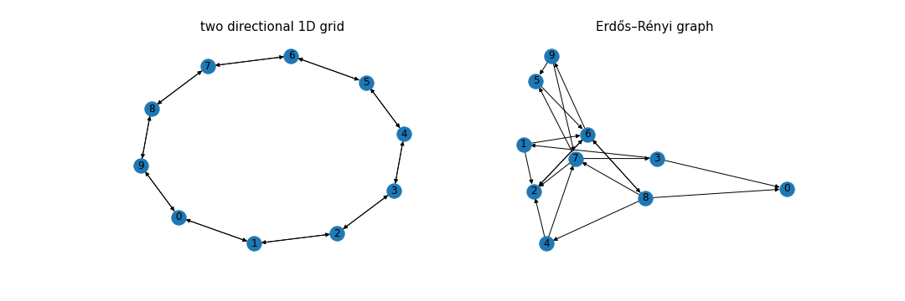

# math-models-final-project

 simulation.ipynb - Jupyter notebook with all functions for simulations. To find a fraction/influence of a network you need to clarify parameters p, M, nsim. Folders with M, nsim will be created and all the results are saved there.
 
plots_and_simulaltions.zip contain two folders - 'simulations' and 'simulations_plot'
-first one contain simulations done for the project
-second one contain different plots for comparison

more_plots.ipynb - Jupyter notebook, in which results from simulations folder are loaded and different graphs are ploted
